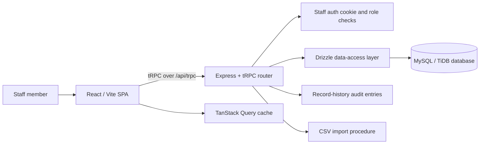
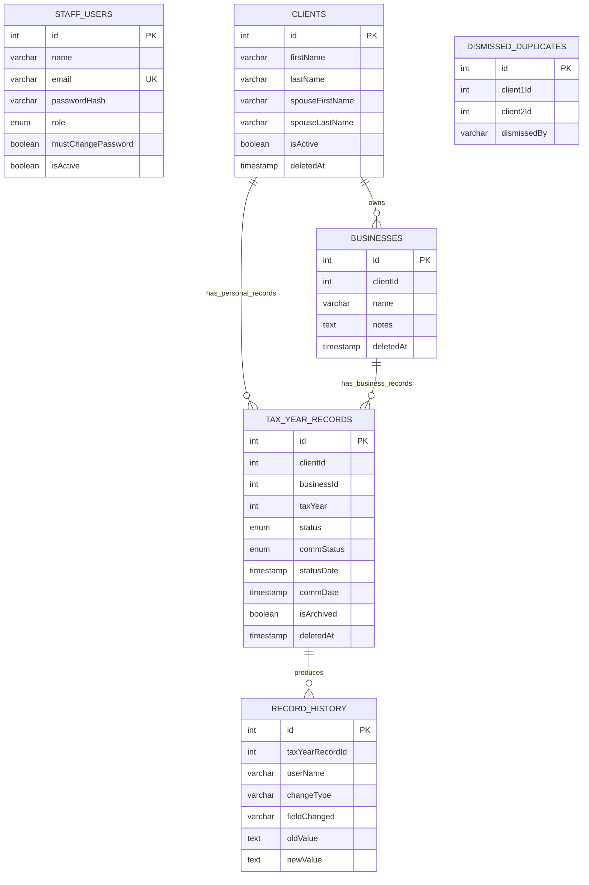

# TaxAce Pickup Log — Rebuild Blueprint

**Author:** Manus AI  
**Document purpose:** Provide a complete technical and functional specification for rebuilding the current TaxAce Pickup Log application without relying on tribal knowledge.  
**Baseline:** Current project source and validated filter-state checkpoint `7ee6c2a9`.

> **Scope statement.** TaxAce Pickup Log is an internal staff application for tracking physical tax-document files by client, business, tax year, workflow status, communication activity, pickup/mailing, archive state, and change history. The active operational login model is individual staff email-and-password access, with administrator-only team management and permanent record deletion.

## 1. Product Model and Operating Principles

The application is designed around a **client file**. A client may have multiple personal tax-year records and may also own one or more connected businesses or trusts. Each business can have its own tax-year records. Users move individual records through a fixed status workflow, record communications, archive records that should not appear in daily work queues, and use filtered lists to identify the next actions.

The system keeps deletions soft wherever possible. Clients, businesses, and tax-year records use a `deletedAt` timestamp rather than immediate physical deletion. Archiving is distinct from deletion: an archived tax-year record remains attached to the client file and can be restored. These two concepts must remain separate in any rebuild. [2]

| Principle | Rebuild requirement |
|---|---|
| **One source of truth** | Use a relational database for all clients, businesses, records, users, and history. Do not manage operational records in browser storage. |
| **File-centric workflow** | Make client profiles the primary place for managing personal and business tax-year records. |
| **Role safety** | All users can perform day-to-day work; only admins can manage staff and permanently delete tax-year records. |
| **Auditability** | Log status changes, archive actions, and merge operations to a durable record-history table. |
| **Low-friction list work** | Support quick inline status changes, bulk updates, status-specific queues, and search. |
| **Archive discipline** | Archived and inactive data must be intentionally shown through explicit toggles, never mixed into default daily queues. |

## 2. Technology Stack

The project is a TypeScript monorepo with a React single-page application and an Express/tRPC backend. Vite builds the browser client while esbuild bundles the Node server. Data access uses Drizzle ORM against a MySQL-compatible database. [1]

| Layer | Current technology | Rebuild responsibility |
|---|---|---|
| Frontend | React 19, TypeScript, Vite 7 | Routes, tables, dialogs, forms, filtering, responsive staff interface. |
| Styling | Tailwind CSS 4, Radix UI/shadcn-style primitives, Lucide icons, Sonner | Design tokens, accessible controls, dialogs, select menus, toast feedback. |
| Routing | Wouter | Client-side navigation and status-specific record routes. |
| Server | Express 4, tRPC 11, Zod | Typed API contracts, input validation, request handling. |
| Data | Drizzle ORM + `mysql2` + MySQL/TiDB-compatible database | Schema, migrations, query helpers, transactional data behavior. |
| Authentication | `bcryptjs`, `jose`, signed HTTP cookie | Individual staff login, session JWT, password hashing, first-login reset enforcement. |
| Client data | TanStack React Query via tRPC | Query caching, invalidation, server-state refresh after mutations. |
| Testing | Vitest, TypeScript compiler | Procedure/unit coverage, type safety, regression checks. |

### Build and Runtime Commands

| Command | Purpose |
|---|---|
| `pnpm dev` | Starts the development server through `tsx watch server/_core/index.ts`. |
| `pnpm check` | Runs `tsc --noEmit` for static type checking. |
| `pnpm test` | Runs the Vitest suite. |
| `pnpm build` | Builds the Vite client and bundles the Node server into `dist/`. |
| `pnpm start` | Runs the production server bundle. |
| `pnpm db:push` | Generates and applies Drizzle migrations; for controlled production changes, review generated SQL before execution. |

## 3. High-Level Architecture



The browser application uses `AppLayout` as its shell. It calls `staffAuth.me` to determine whether the visitor has a valid staff session. Visitors without a session are shown the dedicated staff sign-in screen; authenticated users receive the sidebar, top search bar, page router, and role-specific controls. [3]

The backend composes feature routers beneath one tRPC application router. Business logic that needs reusable database queries lives in `server/db.ts`, while the tRPC route modules focus on validated inputs, authorization, and mutation orchestration. [4] [6]

## 4. Folder Structure

The following tree documents the meaningful application folders. Generated dependencies, Git metadata, logs, and production build artifacts are intentionally excluded.

```text
taxace-pickup-log/
├── client/
│   ├── index.html                         # Vite document shell
│   └── src/
│       ├── App.tsx                        # Routes and application providers
│       ├── main.tsx                       # React entry point / tRPC provider
│       ├── index.css                      # Global styles, themes, status colors
│       ├── components/
│       │   ├── AppLayout.tsx              # Staff auth gate, sidebar, top bar
│       │   ├── GlobalSearch.tsx           # Cross-client / business search
│       │   ├── StatusBadge.tsx            # Status labels, colors, options
│       │   ├── ErrorBoundary.tsx          # Client-side fallback UI
│       │   └── ui/                         # Reusable Radix-based primitives
│       ├── contexts/ThemeContext.tsx      # Light/dark theme provider
│       ├── lib/trpc.ts                    # Typed tRPC client binding
│       └── pages/
│           ├── Dashboard.tsx
│           ├── Clients.tsx
│           ├── ClientProfile.tsx
│           ├── RecordsList.tsx
│           ├── DuplicateReview.tsx
│           ├── CsvImport.tsx
│           ├── StaffLogin.tsx
│           ├── TeamManagement.tsx
│           └── ChangePassword.tsx
├── drizzle/
│   ├── schema.ts                           # Canonical Drizzle schema and enums
│   ├── 0000_*.sql … 0008_*.sql             # Ordered database migrations
│   └── meta/                               # Drizzle migration metadata
├── scripts/
│   ├── import-master-log.mjs               # One-off master-log import support
│   ├── migrate-prepped.mjs                 # Historical status migration helper
│   └── seed-staff.mjs                      # Staff-account seed helper
├── server/
│   ├── _core/                              # Express, tRPC, env, cookies, Vite bridge
│   ├── db.ts                               # Reusable queries and domain operations
│   ├── routers.ts                          # Root tRPC router composition
│   ├── routers/
│   │   ├── staffAuth.ts
│   │   ├── clients.ts
│   │   ├── businesses.ts
│   │   ├── taxYearRecords.ts
│   │   └── misc.ts
│   ├── taxace.test.ts                      # Feature regression tests
│   └── auth.logout.test.ts                 # Auth/logout regression tests
├── shared/                                 # Cross-layer types and constants
├── package.json                            # Scripts and dependencies
├── drizzle.config.ts                       # Drizzle configuration
├── vite.config.ts                          # Vite settings
├── vitest.config.ts                        # Vitest settings
└── todo.md                                 # Project change history and work checklist
```

## 5. Database Schema

### 5.1 Entity Relationship Model



The schema permits a tax-year record to belong to a personal client or a connected business. Application logic treats these as mutually exclusive ownership options; the rebuild should retain the same invariant and ideally enforce it with a database check constraint if the target database supports it. [2]

### 5.2 Tables and Fields

| Table | Purpose | Principal fields |
|---|---|---|
| `users` | Legacy Manus OAuth identity table retained by the framework. | `openId`, `name`, `email`, `loginMethod`, `role`, sign-in timestamps. |
| `staffUsers` | Active staff-access table for individual email/password accounts. | `name`, normalized unique `email`, `passwordHash`, `role`, `mustChangePassword`, `isActive`, `lastSignedIn`. |
| `clients` | Client master file and spouse/partner details. | Required `firstName`, required `lastName`, optional spouse fields, `notes`, `isActive`, `deletedAt`. |
| `businesses` | Businesses, trusts, or entities connected to a client. | `clientId`, `name`, `notes`, `deletedAt`. |
| `tax_year_records` | Operational unit of work: one client/business tax year file. | Owner ID, `taxYear`, status, communication status/dates, notes, archive and delete flags. |
| `record_history` | Human-readable audit events for each tax-year record. | Record ID, actor name, change type, field, old/new values, description, timestamp. |
| `dismissed_duplicates` | Pair-level record that suppresses a known non-duplicate candidate. | Normalized client ID pair, optional actor, timestamp. |

### 5.3 Tax-Year Record Details

| Field | Meaning and rebuild behavior |
|---|---|
| `clientId` / `businessId` | Exactly one owner should be supplied. Personal records use the client; entity records use the business. |
| `taxYear` | Required calendar/tax year used in all list grouping and duplicate merge conflict resolution. |
| `status` | The operational document workflow status. |
| `statusDate` | Timestamp automatically refreshed when the primary status changes. |
| `commStatus` | Separate communication outcome for calls/emails. |
| `commDate` | Timestamp automatically refreshed when the communication outcome changes. |
| `printedCopy` | Optional `Yes`/`No` flag. |
| `datePickedUp` / `dateShredded` | Legacy compatibility dates that are still auto-updated for their matching terminal statuses. |
| `notes` | Free-form staff notes. |
| `isArchived` | Operational archive switch. The default list shows `false`; the archive view shows `true` only. |
| `deletedAt` | Soft-deletion marker; deleted records are absent from operational queries. |

### 5.4 Controlled Enums

| Tax status workflow | Communication status workflow |
|---|---|
| In Vault | Not Contacted |
| Contacted | Left Voicemail |
| Scheduled | Called No Answer |
| Prepped for Pickup | Spoke to Client |
| Picked Up | Email Sent |
| Prepped for Mail |  |
| Mailed |  |
| Prep to Shred |  |
| Shredded |  |
| Hold |  |

The UI uses distinct colors for each tax status. **Prepped for Mail** deliberately shares the prepped/pickup visual family, while **Mailed** shares the completed/picked-up visual family. Both must appear in status selectors, sidebar links, dashboard cards, status legends, and client-list year badges. [2] [3]

## 6. Authentication, Sessions, and Roles

### 6.1 Active Staff Login Flow

Staff access uses an email and password stored in `staffUsers`. Passwords are hashed with bcrypt at cost 12. A successful login updates `lastSignedIn`, creates an HS256 JWT carrying the staff user ID and a `staff` token type, and writes it into the `taxace_staff_session` cookie. The cookie lifespan is configured as one year. [5]

Newly added or reset staff users receive the temporary password `WelcomeTaxAce!` and `mustChangePassword = true`. The sign-in experience requires a new password before completing first access; permanent passwords must be at least eight characters and cannot remain the temporary password. [5]

| Capability | Regular user | Admin |
|---|---:|---:|
| View/search clients and businesses | Yes | Yes |
| Add and edit clients, businesses, and records | Yes | Yes |
| Change status and communication details | Yes | Yes |
| Archive/unarchive records | Yes | Yes |
| Use CSV import and duplicate review | Yes | Yes |
| Delete a tax-year record | No | Yes |
| View/manage staff accounts | No | Yes |
| Add members, reset passwords, change role, deactivate accounts | No | Yes |

### 6.2 Administrator Safeguards

Team-management procedures verify the active staff cookie and require `role = admin`. An administrator cannot deactivate their own account using the normal removal flow. Removal is reversible because it sets `isActive = false` rather than deleting the staff row. [5]

### 6.3 Legacy Authentication Components

The repository retains framework-level Manus OAuth support and a historical site-password router/component. The active application shell uses `staffAuth.me` and the staff login page, not the shared-password gate. Preserve legacy components only if compatibility is required; do not make them the primary staff-access path in a rebuild. [3] [4]

## 7. API and Domain Operations

All application APIs are tRPC procedures registered by the root router. Inputs are validated with Zod; client calls use the generated typed tRPC client. [4]

| Router | Key responsibilities |
|---|---|
| `staffAuth` | Login, logout, current staff lookup, change password, list/add/update/deactivate staff, reset password. |
| `clients` | Client list, summarized list, detail read, create, update, soft delete. |
| `businesses` | Client-linked business list, detail read, search, create, update, soft delete. |
| `taxYearRecords` | Personal/business record lists, all-record list, create/update, archive/unarchive, record deletion. |
| `history` | Record audit trail retrieval. |
| `dashboard` | Live status and client count aggregation. |
| `search` | Global client/business search. |
| `duplicates` | Duplicate candidate detection, dismissals, and client merges. |
| `csvImport` | Bulk row import from the CSV UI. |
| `bulk` | Multi-record status changes with terminal-status skip behavior. |

### 7.1 Key Business Rules

The following behavior is essential to preserve:

| Rule | Current behavior |
|---|---|
| Required client identity | Client creation requires first and last name; spouse fields are optional and split for searching. |
| Status date | A status change stamps `statusDate`. Picked Up/Shredded also populate their legacy compatibility dates. |
| Communication date | A communication-status change stamps `commDate`. |
| Communication promotion | Selecting **Spoke to Client** can promote the primary status to **Contacted** when appropriate. |
| Bulk status update | Records already **Picked Up** or **Shredded** are skipped. The result returns updated and skipped counts. |
| Archive action | Archive/unarchive toggles `isArchived` and writes a history event. |
| Record deletion | Tax-year deletion is soft deletion and is restricted to admin use. |
| Client/business deletion | Client and business removal uses `deletedAt`; operational queries exclude them. |
| Duplicate merge | Businesses and non-conflicting records move to a selected primary client. Year conflicts are resolved per record, losing records are soft-deleted, and the duplicate client is soft-deleted. |

## 8. User-Facing Features

### 8.1 Dashboard

The dashboard presents clickable totals for total clients and each tax-record status. It separately summarizes active and inactive clients. The **All Records** dashboard total represents records considered currently in house, not every historical record, so rebuilders should retain the existing status-selection logic rather than simply counting every row. [6]

### 8.2 Clients List

The Clients page offers an A–Z client file view, name/spouse search, status and tax-year filter chips, an inactive-only switch, a color legend, related business names, notes indicators, and colored tax-year badges. Users can click a year badge to perform a quick status update without opening the profile. [3]

Client filters use their own `sessionStorage` namespace. The current client-page search, selected statuses, selected years, and inactive toggle persist while navigating away and return when the user revisits the Clients page. Selecting **Clear** resets only the Clients filters. [3]

### 8.3 Client Profile

The profile page is the detailed client-file workspace. It supports:

| Section | Functionality |
|---|---|
| Client header | Back navigation, edit client, remove client, active/inactive state. |
| Personal Tax Year Records | Add, edit, inline status/communication updates, record history, archive/unarchive, admin delete, row selection, select all, and bulk status changes. |
| Archive visibility | A **Show Archived** control reveals archived tax years in the file. |
| Connected Businesses | Add businesses; expand each business’s own tax-year record list and manage those records using the same core controls. |
| Confirmations | Archive and permanent-delete dialogs protect against accidental actions. |

### 8.4 All Records and Status Queues

`RecordsList.tsx` is a reusable view for **All Records** and all individual status queues. It provides a searchable, sortable, multi-selectable table with client/business context, tax year, grouped status/date and communication status/date columns, inline status changes, history, archive controls, and admin-only deletion. [7]

The route map includes separate queues for In Vault, Contacted, Scheduled, Prepped for Pickup, Picked Up, Prepped for Mail, Mailed, Prep to Shred, Shredded, and Hold. [4]

### 8.5 Archive, Inactive, and Filter-State Rules

This behavior was explicitly hotfixed and verified. Preserve it exactly:

1. **Show Archived** displays archived records only; it does not append archived records to the default list.
2. **Show Inactive** displays clients or records belonging to inactive clients only; it does not mix active and inactive entries.
3. **Clients** and **All Records** keep independent working filters in separate session-storage keys until the user selects that page’s **Clear** action.
4. Individual status tabs always begin with their own fixed status context and do not inherit All Records or other status-tab filters.
5. Clear resets search, status chips, tax-year chips, archive state, and inactive state for the current list scope. [7]

### 8.6 Duplicate Review

Duplicate detection identifies potential client pairs using similar last-name/first-initial logic, matching spouse names, and the same business name connected to different clients. Users can dismiss a pair as not a duplicate or merge it. The merge experience compares both records by tax year and requests an explicit keep decision for conflicts. [6]

### 8.7 CSV Import

The CSV import page supplies a downloadable template, client-side parsing and preview, server-side validation/import, and a visible result summary. It supports import of client identity, spouse details, tax year, status, status date, communication status/date, notes, print status, and business information according to the active import contract. [8]

The historical master-log import scripts are operational helpers rather than the normal day-to-day user path. Preserve them separately from the in-app CSV import page.

### 8.8 Global Search

The top bar searches clients and businesses after sufficient query input, presents separate result sections, and navigates back to the owning client profile. Client search includes both client and spouse names; business results resolve through their `clientId`. [6]

### 8.9 Team Management and Account Maintenance

The admin-only Team Management page lists staff name, email, role, active state, first-login/reset state, and last sign-in. Administrators can add a person, assign a role, reset a password to the temporary password, deactivate/reactivate a member, and rename a member. All staff can use the account menu to change their own password and sign out. [3] [5]

## 9. UI and Interaction Standards

The visual design is a dark TaxAce sidebar with a compact teal/green logo, a light working surface, teal primary actions, color-coded status badges, icon-supported table actions, and Radix-backed keyboard-accessible controls. It uses responsive sidebar behavior: desktop users can resize and collapse the sidebar, while mobile users receive a toggle control. [3]

All rebuild work should preserve the following interaction details:

| Area | Requirement |
|---|---|
| Feedback | Use toast messages for successful/failed mutations and inline loading/empty states. |
| Dangerous actions | Require confirmation before archive and delete. Make delete destructive styling visually distinct. |
| Accessibility | Keep labels, button hints/tooltips, focus states, and keyboard-support from the UI primitives. |
| Status selectors | Render status labels with the matching colored badge/pill rather than plain unstyled text. |
| Data tables | Keep the client/business context visible and avoid reintroducing the removed location column. |
| Responsive behavior | Retain responsive sidebar controls and avoid horizontal overflow in record-management tables. |

## 10. Migration and Deployment Procedure

### 10.1 Schema Changes

Use the schema-first workflow below for any future database change:

1. Modify `drizzle/schema.ts`.
2. Generate a Drizzle migration using the project command.
3. Review the generated SQL for safety and dependency order.
4. Apply the migration exactly once to the production database.
5. Update query helpers, tRPC inputs, UI types, and tests in the same change.
6. Run `pnpm check`, `pnpm test`, and `pnpm build`.

The existing migration history runs from `0000_damp_firebird.sql` through `0008_cleanup_orphaned_client_records.sql`. A rebuild should preserve ordered migration tracking and must never replay destructive cleanup migrations against an unknown data set without review. [2]

### 10.2 Validation Gate

Before every release, run:

```bash
pnpm check
pnpm test
pnpm build
```

Then manually verify staff sign-in, a standard user’s non-admin experience, an admin deletion confirmation, client profile archive visibility, each status queue, CSV preview/import with a small sample, and filter isolation between Clients, All Records, and one individual status tab.

### 10.3 Deployment Notes

The project is hosted through the managed TaxAce Pickup Log deployment. Preserve the existing domain configuration and publish only from a saved checkpoint. Environment values and passwords must be supplied through secure environment settings; they must never be stored in the repository, a CSV, or a downloadable code archive.

## 11. Rebuild Sequence

The following sequence minimizes risk when rebuilding from scratch:

| Stage | Deliverable | Acceptance criterion |
|---|---|---|
| 1. Foundation | React/Vite/Express/tRPC/Drizzle project skeleton | `pnpm check` and `pnpm build` work. |
| 2. Schema | All tables, enums, and initial migration | Client, business, record, history, and staff entities can be created. |
| 3. Auth | Individual staff login and role checks | New user must reset temp password; inactive user cannot sign in. |
| 4. Core CRUD | Client, business, and tax-year workflows | A standard user can create and edit a complete client file. |
| 5. Records workflow | Statuses, dates, bulk behavior, history, archive/delete rules | Terminal-status bulk skips and audit history work. |
| 6. Lists/dashboard | Dashboard, Clients, All Records, status queues, search | Counts and filters reconcile with the database. |
| 7. Exceptions | Duplicate review/merge, CSV import, inactive/archive views | Merge preserves selected records and filters are isolated. |
| 8. Administration | Team Management and account settings | Admin-only controls are server-enforced. |
| 9. Verification | Tests, build, manual staff acceptance test | No regressions in filter, archive, or permissions behavior. |

## 12. Critical Preservation Checklist

Before declaring a rebuild complete, confirm all items below are true.

- [ ] Individual staff email/password authentication is active; shared password is not the primary staff login.
- [ ] Admin and user roles are enforced on the server, not merely hidden in the UI.
- [ ] Clients have required first and last names; spouse first/last names remain searchable.
- [ ] Personal and business tax-year records are both supported.
- [ ] The ten-status workflow includes both mail statuses everywhere.
- [ ] Status changes stamp status dates; communication changes stamp communication dates.
- [ ] All non-deleted operational lists exclude archived records by default.
- [ ] Show Archived and Show Inactive each produce an exclusive, not additive, view.
- [ ] Clients and All Records preserve their own filters until Clear; status tabs remain isolated.
- [ ] Bulk updates skip Picked Up and Shredded records and report the skip count.
- [ ] Archive and delete confirmations exist; delete is admin-only.
- [ ] Record history survives status, archive, and merge actions.
- [ ] Duplicate dismissal and merge conflict resolution work at the tax-year level.
- [ ] CSV import provides template, preview, validation feedback, and safe result reporting.
- [ ] Team Management supports adding, role changes, password resets, and reversible deactivation.

## References

[1]: ../package.json "Project dependencies and build scripts"
[2]: ../drizzle/schema.ts "Drizzle database schema and controlled enums"
[3]: ../client/src/components/AppLayout.tsx "Staff-authenticated application shell, navigation, and admin UI visibility"
[4]: ../client/src/App.tsx "Client route map"; ../server/routers.ts "Root tRPC route map"
[5]: ../server/routers/staffAuth.ts "Staff login, password management, and team-administration procedures"
[6]: ../server/db.ts "Core query helpers, data rules, dashboard counts, duplicate detection, merge, archive, and filtered list behavior"
[7]: ../client/src/pages/RecordsList.tsx "All Records/status queue behavior and filter-state isolation"; ../client/src/pages/Clients.tsx "Client-list filters and quick status controls"
[8]: ../client/src/pages/CsvImport.tsx "CSV import interface and template workflow"
